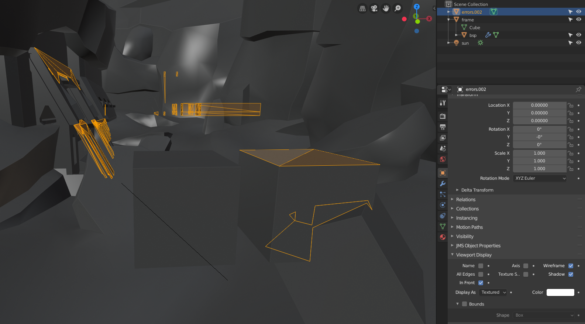

# Miscellaneous Tools

## WRL to OBJ converter
If your level geometry is not sealed or is otherwise non-manifold, tool.exe will produce a corresponding `.wrl` file in your working directory which contains some "debug geometry". It's helpful to import this into your 3D software to see where the errors are and correct them.

Unfortunately, the format of these files (VRML 1.0) is quite outdated and Blender does not support it. This script converts the WRL file to an OBJ file which _can_ be imported by Blender.

### Usage
The converter depends on the Python package `tatsu`, a parser generator. The MEK installer will install this for you, but otherwise you can run `pip install --user tatsu`.

Invoke the converter on the command line like so:

```sh
# given file paths for input and output:
python3 wrl_to_obj.py --input input.wrl --output output.obj

# as an executable, converting from stdin to stdout:
./wrl_to_obj.py < input.wrl > output.obj
```

When importing the `.obj` into Blender, be sure to use **Y forward and Z up** settings. For greater visibility, I recommend setting the imported object's viewport display to "In Front", selecting the object, and switching to single colour viewport shading:


