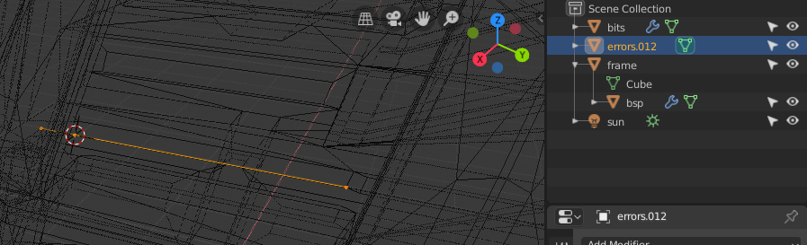

# Blender Scripts

## WRL to OBJ
If your level geometry is not sealed or is otherwise non-manifold, tool.exe will produce a corresponding `.wrl` file in your working directory which contains some "debug geometry". It's helpful to import this into your 3D software to see where the errors are and correct them.

Unfortunately, its VRML 1.0 file format is unsupported by Blender. This script performs a basic conversion of the file to an OBJ file containing edge segments, which can be imported by Blender:

```sh
# given a file path:
python wrl-to-obj.py input.wrl > output.obj

# from stdin:
python wrl-to-obj.py < input.wrl > output.obj
```

When importing the `.obj` into Blender, be sure to use Y forward and Z up settings. You can then easily see the errors by highlighting the imported object's edges in wireframe view:


